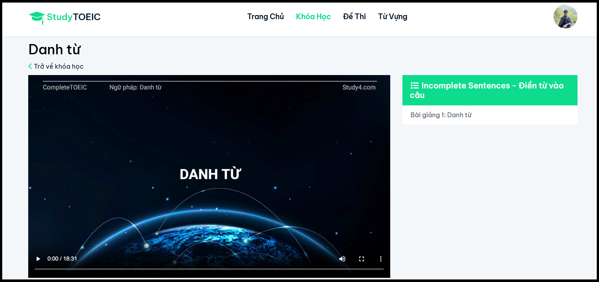
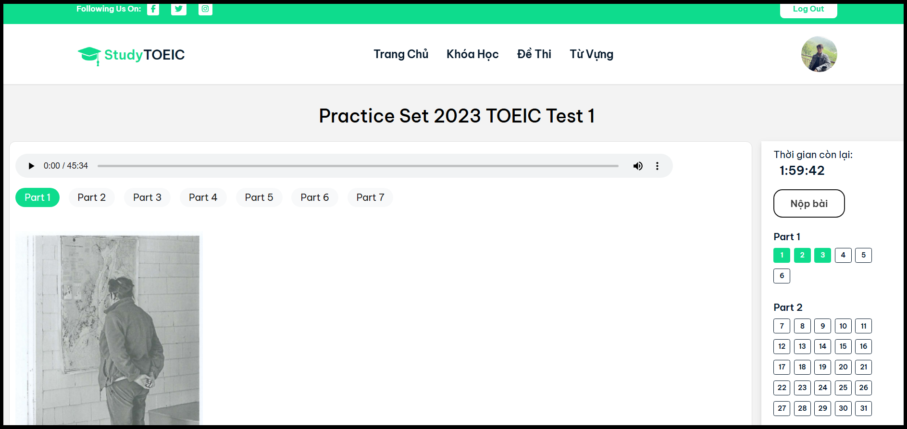
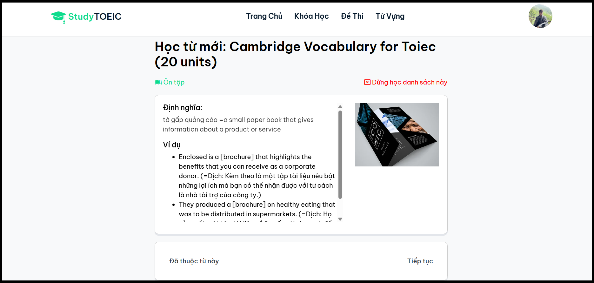

# TOEIC Online Learning System

## Overview

This project is an online TOEIC learning system with 3 main user roles: **Student**, **Teacher**, and **Admin**.  
Students can create an account, register for courses to watch video lessons, learn vocabulary with flashcards, and take TOEIC practice tests.  
Teachers can manage courses, questions, and vocabulary.  
Admins manage users and monitor system activities.  
The system helps students prepare for the TOEIC exam through high-quality courses and the latest practice tests.

---

## Demo

**You can watch the video demo [here](https://www.youtube.com/watch?v=Ye9fkGXgbnQ)**

   
  <em>Figure: Watch course videos</em>

   
  <em>Figure: Take TOEIC practice tests</em>

   
  <em>Figure: Learn vocabulary with flashcards</em>

---

## Main Features

### 1. Student

- Register cource
- Watch course videos
- Learn vocabulary via flashcards
- Take TOEIC practice tests (structured by parts)
- View test answers and explanations and test history

### 2. Teacher

- Manage TOEIC tests
- Provide correct answers and explanations
- Create and manage video-based courses
- Create and manage vocabulary lists for flashcards

### 3. Admin

- Manage all users (students and teachers)
- Assign roles and permissions
- Track system usage and activities.
  
---

## Technologies Used

- JSP / Servlet
- MySQL
- Apache Tomcat

